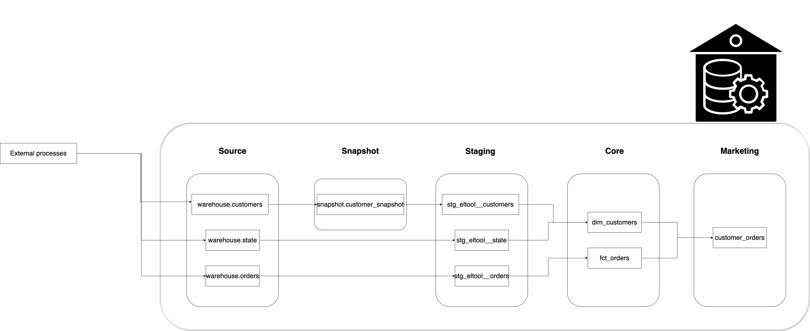
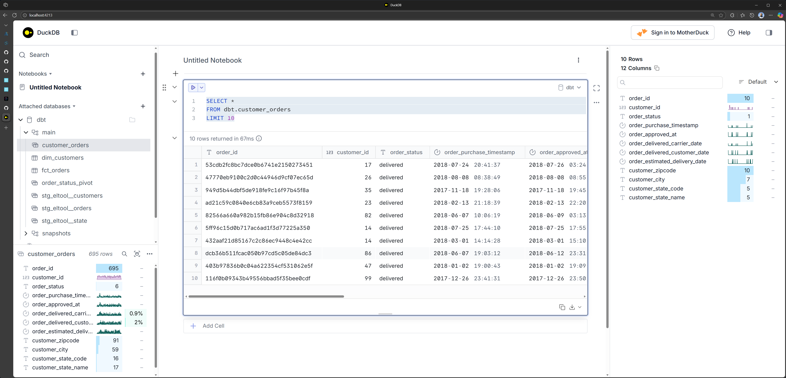

# DBT with DuckDB

* [Website snapshot](https://web.archive.org/web/20251014064901/https://www.startdataengineering.com/post/dbt-data-build-tool-tutorial/)
* [Code snapshot](https://github.com/josephmachado/simple_dbt_project/tree/345ef554396e55476ec41dc5b62b3da0fc074ccc)



## Environment setup

```bash
GIT_ROOT=$(git rev-parse --show-toplevel)
cd "${GIT_ROOT}/tutorials/2_duckdb"

rm -rf .venv
uv python install 3.13
uv venv --python 3.13
uv sync
source .venv/bin/activate
```

## Run dbt 

Run dbt commands as shown below:

```bash
dbt clean
dbt deps
dbt snapshot
dbt run
dbt test
dbt docs generate
dbt docs serve
```

Go to [http://localhost:8080](http://localhost:8080) to see the dbt documentation. If you are running this on GitHub CodeSpaces, follow [this section]() to expose port 8080 for access from your browser.

Press `Ctrl + C` to stop the document server.

## Query in DuckDB

```bash
# Start UI
duckdb -ui

# ┌────────────────────────────────────────────┐
# │                   result                   │
# │                  varchar                   │
# ├────────────────────────────────────────────┤
# │ Navigate browser to http://localhost:4213/ │
# └────────────────────────────────────────────┘
```

> Create/attach a database at /home/mdrrahman/dbt-demo/tutorials/2_duckdb/dbt.duckdb



## Create snapshots

Let's do some testing, Insert some data into source customer table(in our case the new_customer data is appended into customers.csv), to demonstrate dbt snapshots. Since we are using duckdb and the base table is essentially data at [customer.csv](./raw_data/customer.csv) we have to append new data to this customer.csv file as shown below:

```bash
# Remove header from ./raw_data/customers_new.csv
# and append it to ./raw_data/customers.csv
echo "" >> ./raw_data/customers.csv
tail -n +2 ./raw_data/customer_new.csv >> ./raw_data/customers.csv
```

Run snapshot and create models again.

```bash
dbt snapshot
dbt run 
```

Reset `customers.csv`:
```bash
head -n -5 ./raw_data/customers.csv > temp
cat temp > ./raw_data/customers.csv
rm temp
```

Let's open a DuckDB CLI and check our data, as shown below:

```sql
ATTACH '/home/mdrrahman/dbt-demo/tutorials/2_duckdb/dbt.duckdb' AS dbt;

SELECT * FROM dbt.snapshots.customers_snapshot WHERE customer_id = 82;

-- ┌─────────────┬─────────┬──────────────┬────────────┬─────────────────────┬───┬──────────────────────┬─────────────────────┬─────────────────────┬──────────────┐
-- │ customer_id │ zipcode │     city     │ state_code │  datetime_created   │ … │      dbt_scd_id      │   dbt_updated_at    │   dbt_valid_from    │ dbt_valid_to │
-- │    int64    │ varchar │   varchar    │  varchar   │      timestamp      │   │       varchar        │      timestamp      │      timestamp      │  timestamp   │
-- ├─────────────┼─────────┼──────────────┼────────────┼─────────────────────┼───┼──────────────────────┼─────────────────────┼─────────────────────┼──────────────┤
-- │     82      │ 59655   │ areia branca │ RN         │ 2017-10-18 00:00:00 │ … │ d5ce49419bd8ed844a…  │ 2017-10-18 00:00:00 │ 2017-10-18 00:00:00 │ NULL         │
-- ├─────────────┴─────────┴──────────────┴────────────┴─────────────────────┴───┴──────────────────────┴─────────────────────┴─────────────────────┴──────────────┤
-- │ 1 rows                                                                                                                                   10 columns (9 shown) │
-- └───────────────────────────────────────────────────────────────────────────────────────────────────────────────────────────────────────────────────────────────┘
```

