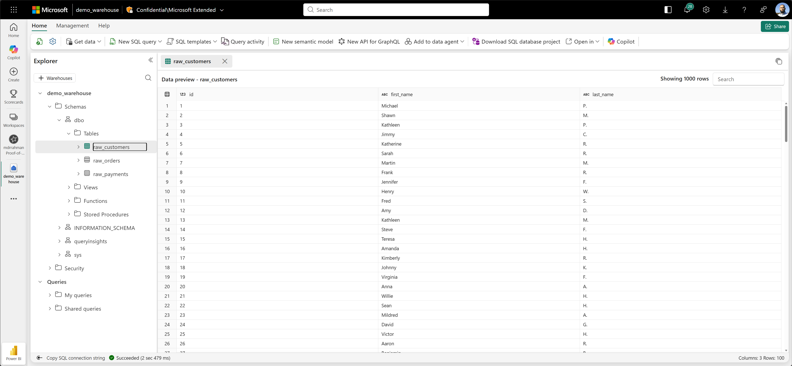

# Microsoft official

* [Microsoft Official](https://learn.microsoft.com/en-us/fabric/data-warehouse/tutorial-setup-dbt)

## Environment setup

```bash
GIT_ROOT=$(git rev-parse --show-toplevel)
cd "${GIT_ROOT}/tutorials/5_fabric_dwh/msft_official"

python -m venv env
source env/bin/activate
pip install -r requirements.txt

dbt --version
```

## Project setup

Test connectivity:

```bash
cd "${GIT_ROOT}/tutorials/5_fabric_dwh/msft_official/jaffle-shop-classic"
export DBT_PROFILES_DIR=$(pwd)
dbt debug

# 21:57:48  Running with dbt=1.11.2
# 21:57:48  dbt version: 1.11.2
# 21:57:48  python version: 3.13.11
# 21:57:48  python path: /home/mdrrahman/dbt-demo/tutorials/5_fabric_dwh/msft_official/env/bin/python3.13
# 21:57:48  os info: Linux-6.6.87.2-microsoft-standard-WSL2-x86_64-with-glibc2.39
# 21:57:48  Using profiles dir at /home/mdrrahman/dbt-demo/tutorials/5_fabric_dwh/msft_official/jaffle-shop-classic
# 21:57:48  Using profiles.yml file at /home/mdrrahman/dbt-demo/tutorials/5_fabric_dwh/msft_official/jaffle-shop-classic/profiles.yml
# 21:57:48  Using dbt_project.yml file at /home/mdrrahman/dbt-demo/tutorials/5_fabric_dwh/msft_official/jaffle-shop-classic/dbt_project.yml
# 21:57:48  adapter type: fabric
# 21:57:48  adapter version: 1.9.8
# 21:57:48  Configuration:
# 21:57:48    profiles.yml file [OK found and valid]
# 21:57:48    dbt_project.yml file [OK found and valid]
# 21:57:48  Required dependencies:
# 21:57:48   - git [OK found]

# 21:57:48  Connection:
# 21:57:48    server: x6eps4xrq2xudenlfv6naeo3i4-e6y6fnhrgltuti5kvb63urezbq.msit-datawarehouse.fabric.microsoft.com
# 21:57:48    database: demo_warehouse
# 21:57:48    schema: dbo
# 21:57:48    warehouse_snapshot_name: None
# 21:57:48    snapshot_timestamp: None
# 21:57:48    UID: None
# 21:57:48    workspace_id: None
# 21:57:48    authentication: CLI
# 21:57:48    retries: 3
# 21:57:48    login_timeout: 0
# 21:57:48    query_timeout: 0
# 21:57:48    trace_flag: False
# 21:57:48    encrypt: True
# 21:57:48    trust_cert: False
# 21:57:48    api_url: https://api.fabric.microsoft.com/v1
# 21:57:48  Registered adapter: fabric=1.9.8
# 21:57:52    Connection test: [OK connection ok]

# 21:57:52  All checks passed!
```

Seed:

```bash
dbt seed

# 21:59:24  Running with dbt=1.11.2
# 21:59:24  Registered adapter: fabric=1.9.8
# 21:59:24  Unable to do partial parsing because saved manifest not found. Starting full parse.
# 21:59:26  [WARNING][MissingArgumentsPropertyInGenericTestDeprecation]: Deprecated
# functionality
# Found top-level arguments to test `relationships` defined on 'orders' in package
# 'jaffle_shop' (models/schema.yml). Arguments to generic tests should be nested
# under the `arguments` property.
# 21:59:26  Found 5 models, 3 seeds, 20 data tests, 504 macros
# 21:59:26  
# 21:59:26  Concurrency: 4 threads (target='fabric-dev')
# 21:59:26  
# 21:59:30  1 of 3 START seed file dbo.raw_customers ....................................... [RUN]
# 21:59:30  3 of 3 START seed file dbo.raw_payments ........................................ [RUN]
# 21:59:30  2 of 3 START seed file dbo.raw_orders .......................................... [RUN]
# 21:59:32  1 of 3 OK loaded seed file dbo.raw_customers ................................... [INSERT 100 in 1.88s]
# 21:59:32  2 of 3 OK loaded seed file dbo.raw_orders ...................................... [INSERT 99 in 1.88s]
# 21:59:32  3 of 3 OK loaded seed file dbo.raw_payments .................................... [INSERT 113 in 1.88s]
# 21:59:32  
# 21:59:32  Finished running 3 seeds in 0 hours 0 minutes and 5.73 seconds (5.73s).
# 21:59:32  
# 21:59:32  Completed successfully
# 21:59:32  
# 21:59:32  Done. PASS=3 WARN=0 ERROR=0 SKIP=0 NO-OP=0 TOTAL=3
# 21:59:32  [WARNING][DeprecationsSummary]: Deprecated functionality
# Summary of encountered deprecations:
# - MissingArgumentsPropertyInGenericTestDeprecation: 4 occurrences
# To see all deprecation instances instead of just the first occurrence of each,
# run command again with the `--show-all-deprecations` flag. You may also need to
# run with `--no-partial-parse` as some deprecations are only encountered during
# parsing.
```

And we see:



And fire:

```bash
dbt run

# 22:02:03  Running with dbt=1.11.2
# 22:02:03  Registered adapter: fabric=1.9.8
# 22:02:04  Found 5 models, 3 seeds, 20 data tests, 504 macros
# 22:02:04  
# 22:02:04  Concurrency: 4 threads (target='fabric-dev')
# 22:02:04  
# 22:02:07  fabric adapter: No workspace_id provided; skipping snapshot management.
# 22:02:07  3 of 5 START sql view model dbo.stg_payments ................................... [RUN]
# 22:02:07  1 of 5 START sql view model dbo.stg_customers .................................. [RUN]
# 22:02:07  2 of 5 START sql view model dbo.stg_orders ..................................... [RUN]
# 22:02:08  2 of 5 OK created sql view model dbo.stg_orders ................................ [OK in 0.95s]
# 22:02:08  1 of 5 OK created sql view model dbo.stg_customers ............................. [OK in 0.97s]
# 22:02:09  3 of 5 OK created sql view model dbo.stg_payments .............................. [OK in 1.16s]
# 22:02:09  4 of 5 START sql table model dbo.customers ..................................... [RUN]
# 22:02:09  5 of 5 START sql table model dbo.orders ........................................ [RUN]
# 22:02:13  5 of 5 OK created sql table model dbo.orders ................................... [OK in 4.15s]
# 22:02:13  4 of 5 OK created sql table model dbo.customers ................................ [OK in 4.18s]
# 22:02:13  
# 22:02:13  Finished running 2 table models, 3 view models in 0 hours 0 minutes and 9.14 seconds (9.14s).
# 22:02:13  
# 22:02:13  Completed successfully
# 22:02:13  
# 22:02:13  Done. PASS=5 WARN=0 ERROR=0 SKIP=0 NO-OP=0 TOTAL=5
```

Test to validate data quality:

```bash
dbt test

# 22:03:57  Running with dbt=1.11.2
# 22:03:57  Registered adapter: fabric=1.9.8
# 22:03:58  Found 5 models, 3 seeds, 20 data tests, 504 macros
# 22:03:58  
# 22:03:58  Concurrency: 4 threads (target='fabric-dev')
# 22:03:58  
# 22:04:01  1 of 20 START test accepted_values_orders_status__placed__shipped__completed__return_pending__returned  [RUN]
# 22:04:01  3 of 20 START test accepted_values_stg_payments_payment_method__credit_card__coupon__bank_transfer__gift_card  [RUN]
# 22:04:01  4 of 20 START test not_null_customers_customer_id .............................. [RUN]
# 22:04:01  2 of 20 START test accepted_values_stg_orders_status__placed__shipped__completed__return_pending__returned  [RUN]
# 22:04:01  3 of 20 PASS accepted_values_stg_payments_payment_method__credit_card__coupon__bank_transfer__gift_card  [PASS in 0.39s]
# 22:04:01  5 of 20 START test not_null_orders_amount ...................................... [RUN]
# 22:04:02  2 of 20 PASS accepted_values_stg_orders_status__placed__shipped__completed__return_pending__returned  [PASS in 0.73s]
# 22:04:02  6 of 20 START test not_null_orders_bank_transfer_amount ........................ [RUN]
# 22:04:02  4 of 20 PASS not_null_customers_customer_id .................................... [PASS in 0.76s]
# 22:04:02  7 of 20 START test not_null_orders_coupon_amount ............................... [RUN]
# 22:04:02  5 of 20 PASS not_null_orders_amount ............................................ [PASS in 0.41s]
# 22:04:02  8 of 20 START test not_null_orders_credit_card_amount .......................... [RUN]
# 22:04:02  6 of 20 PASS not_null_orders_bank_transfer_amount .............................. [PASS in 0.11s]
# 22:04:02  9 of 20 START test not_null_orders_customer_id ................................. [RUN]
# 22:04:02  7 of 20 PASS not_null_orders_coupon_amount ..................................... [PASS in 0.11s]
# 22:04:02  10 of 20 START test not_null_orders_gift_card_amount ........................... [RUN]
# 22:04:02  8 of 20 PASS not_null_orders_credit_card_amount ................................ [PASS in 0.12s]
# 22:04:02  11 of 20 START test not_null_orders_order_id ................................... [RUN]
# 22:04:02  11 of 20 PASS not_null_orders_order_id ......................................... [PASS in 0.11s]
# 22:04:02  12 of 20 START test not_null_stg_customers_customer_id ......................... [RUN]
# 22:04:02  9 of 20 PASS not_null_orders_customer_id ....................................... [PASS in 0.21s]
# 22:04:02  13 of 20 START test not_null_stg_orders_order_id ............................... [RUN]
# 22:04:02  12 of 20 PASS not_null_stg_customers_customer_id ............................... [PASS in 0.13s]
# 22:04:02  13 of 20 PASS not_null_stg_orders_order_id ..................................... [PASS in 0.12s]
# 22:04:02  14 of 20 START test not_null_stg_payments_payment_id ........................... [RUN]
# 22:04:02  15 of 20 START test relationships_orders_customer_id__customer_id__ref_customers_  [RUN]
# 22:04:03  14 of 20 PASS not_null_stg_payments_payment_id ................................. [PASS in 0.23s]
# 22:04:03  16 of 20 START test unique_customers_customer_id ............................... [RUN]
# 22:04:04  16 of 20 PASS unique_customers_customer_id ..................................... [PASS in 1.04s]
# 22:04:04  17 of 20 START test unique_orders_order_id ..................................... [RUN]
# 22:04:04  17 of 20 PASS unique_orders_order_id ........................................... [PASS in 0.22s]
# 22:04:04  18 of 20 START test unique_stg_customers_customer_id ........................... [RUN]
# 22:04:04  18 of 20 PASS unique_stg_customers_customer_id ................................. [PASS in 0.11s]
# 22:04:04  19 of 20 START test unique_stg_orders_order_id ................................. [RUN]
# 22:04:04  19 of 20 PASS unique_stg_orders_order_id ....................................... [PASS in 0.13s]
# 22:04:04  20 of 20 START test unique_stg_payments_payment_id ............................. [RUN]
# 22:04:04  1 of 20 PASS accepted_values_orders_status__placed__shipped__completed__return_pending__returned  [PASS in 2.95s]
# 22:04:04  10 of 20 PASS not_null_orders_gift_card_amount ................................. [PASS in 2.08s]
# 22:04:04  20 of 20 PASS unique_stg_payments_payment_id ................................... [PASS in 0.13s]
# 22:04:04  15 of 20 PASS relationships_orders_customer_id__customer_id__ref_customers_ .... [PASS in 2.17s]
# 22:04:04  
# 22:04:04  Finished running 20 data tests in 0 hours 0 minutes and 6.59 seconds (6.59s).
# 22:04:04  
# 22:04:04  Completed successfully
# 22:04:04  
# 22:04:04  Done. PASS=20 WARN=0 ERROR=0 SKIP=0 NO-OP=0 TOTAL=20
```

And we can see the DBT DAG:

```bash
dbt docs generate
dbt docs serve
```