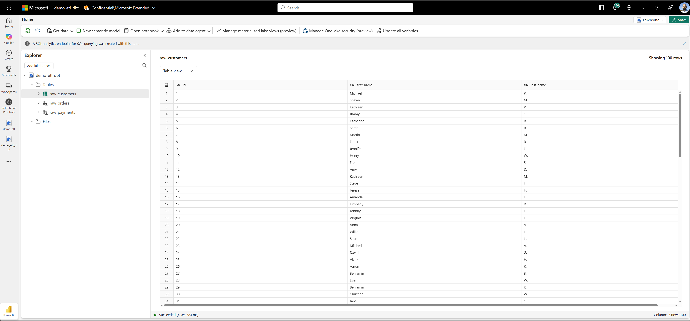

# Microsoft official

* [Microsoft Official](https://learn.microsoft.com/en-us/fabric/data-warehouse/tutorial-setup-dbt)
* [DBT Fabric Spark setup](https://docs.getdbt.com/docs/core/connect-data-platform/fabricspark-setup)
* [DBT Fabric Spark configuration](https://docs.getdbt.com/reference/resource-configs/fabricspark-configs)
* [Livy Endpoint](https://learn.microsoft.com/en-us/fabric/data-engineering/get-started-api-livy#how-to-authorize-the-livy-api-requests-with-an-entra-spn-token)

## Environment setup

```bash
GIT_ROOT=$(git rev-parse --show-toplevel)
cd "${GIT_ROOT}/tutorials/6_fabric_spark/msft_official"

python -m venv env
source env/bin/activate
pip install -r requirements.txt

dbt --version
```

## Project setup

Test connectivity:

> Warning: flaky, needs retries configured for the config

```bash
cd "${GIT_ROOT}/tutorials/6_fabric_spark/msft_official/jaffle-shop-classic"
export DBT_PROFILES_DIR=$(pwd)
dbt debug
```

Seed:

```bash
dbt seed

# 16:55:37  Running with dbt=1.11.2
# 16:55:37  Registered adapter: fabricspark=1.9.0
# 16:55:37  Found 5 models, 3 seeds, 20 data tests, 507 macros
# 16:55:37  
# 16:55:37  Concurrency: 1 threads (target='fabric-dev')
# 16:55:37  
# 16:55:37  Microsoft Fabric-Spark adapter: Using CLI auth
# 16:56:16  1 of 3 START seed file demo_etl_dbt.raw_customers .............................. [RUN]
# 16:56:34  1 of 3 OK loaded seed file demo_etl_dbt.raw_customers .......................... [INSERT 100 in 18.61s]
# 16:56:34  2 of 3 START seed file demo_etl_dbt.raw_orders ................................. [RUN]
# 16:56:48  2 of 3 OK loaded seed file demo_etl_dbt.raw_orders ............................. [INSERT 99 in 13.52s]
# 16:56:48  3 of 3 START seed file demo_etl_dbt.raw_payments ............................... [RUN]
# 16:57:01  3 of 3 OK loaded seed file demo_etl_dbt.raw_payments ........................... [INSERT 113 in 13.21s]
# 16:57:03  
# 16:57:03  Finished running 3 seeds in 0 hours 1 minutes and 25.76 seconds (85.76s).
# 16:57:03  
# 16:57:03  Completed successfully
# 16:57:03  
# 16:57:03  Done. PASS=3 WARN=0 ERROR=0 SKIP=0 NO-OP=0 TOTAL=3
```

And we see:



And fire:

```bash
dbt run

# 00:13:41  Running with dbt=1.11.2
# 00:13:42  Registered adapter: fabricspark=1.9.0
# 00:13:42  Found 5 models, 3 seeds, 20 data tests, 507 macros
# 00:13:42  
# 00:13:42  Concurrency: 12 threads (target='fabric-dev')
# 00:13:42  
# 00:13:42  Microsoft Fabric-Spark adapter: Using CLI auth
# 00:13:45  Microsoft Fabric-Spark adapter: Warning: No message, retrying due to 'retry_all' configuration set to true.
#         Retrying in 10 seconds (0 of 25)
# 00:14:26  1 of 5 START sql view model demo_etl_dbt.stg_customers ......................... [RUN]
# 00:14:26  2 of 5 START sql view model demo_etl_dbt.stg_orders ............................ [RUN]
# 00:14:26  3 of 5 START sql view model demo_etl_dbt.stg_payments .......................... [RUN]
# 00:14:33  1 of 5 OK created sql view model demo_etl_dbt.stg_customers .................... [OK in 6.72s]
# 00:14:39  3 of 5 OK created sql view model demo_etl_dbt.stg_payments ..................... [OK in 12.42s]
# 00:14:39  2 of 5 OK created sql view model demo_etl_dbt.stg_orders ....................... [OK in 12.55s]
# 00:14:39  4 of 5 START sql table model demo_etl_dbt.customers ............................ [RUN]
# 00:14:39  5 of 5 START sql table model demo_etl_dbt.orders ............................... [RUN]
# 00:14:57  4 of 5 OK created sql table model demo_etl_dbt.customers ....................... [OK in 17.73s]
# 00:15:08  5 of 5 OK created sql table model demo_etl_dbt.orders .......................... [OK in 28.74s]
# 00:15:15  
# 00:15:15  Finished running 2 table models, 3 view models in 0 hours 1 minutes and 33.16 seconds (93.16s).
# 00:15:15  
# 00:15:15  Completed successfully
# 00:15:15  
# 00:15:15  Done. PASS=5 WARN=0 ERROR=0 SKIP=0 NO-OP=0 TOTAL=5
```

Test to validate data quality:

```bash
dbt test

# 00:08:16  Running with dbt=1.11.2
# 00:08:16  Registered adapter: fabricspark=1.9.0
# 00:08:17  Found 5 models, 3 seeds, 20 data tests, 507 macros
# 00:08:17  
# 00:08:17  Concurrency: 12 threads (target='fabric-dev')
# 00:08:17  
# 00:08:17  Microsoft Fabric-Spark adapter: Using CLI auth
# 00:08:43  1 of 20 START test accepted_values_orders_status__placed__shipped__completed__return_pending__returned  [RUN]
# 00:08:43  2 of 20 START test accepted_values_stg_orders_status__placed__shipped__completed__return_pending__returned  [RUN]
# 00:08:43  3 of 20 START test accepted_values_stg_payments_payment_method__credit_card__coupon__bank_transfer__gift_card  [RUN]
# 00:08:43  4 of 20 START test not_null_customers_customer_id .............................. [RUN]
# 00:08:43  5 of 20 START test not_null_orders_amount ...................................... [RUN]
# 00:08:43  6 of 20 START test not_null_orders_bank_transfer_amount ........................ [RUN]
# 00:08:43  7 of 20 START test not_null_orders_coupon_amount ............................... [RUN]
# 00:08:43  8 of 20 START test not_null_orders_credit_card_amount .......................... [RUN]
# 00:08:43  9 of 20 START test not_null_orders_customer_id ................................. [RUN]
# 00:08:43  10 of 20 START test not_null_orders_gift_card_amount ........................... [RUN]
# 00:08:43  11 of 20 START test not_null_orders_order_id ................................... [RUN]
# 00:08:43  12 of 20 START test not_null_stg_customers_customer_id ......................... [RUN]
# 00:08:55  1 of 20 PASS accepted_values_orders_status__placed__shipped__completed__return_pending__returned  [PASS in 12.23s]
# 00:08:55  13 of 20 START test not_null_stg_orders_order_id ............................... [RUN]
# 00:08:56  4 of 20 PASS not_null_customers_customer_id .................................... [PASS in 13.05s]
# 00:08:56  14 of 20 START test not_null_stg_payments_payment_id ........................... [RUN]
# 00:08:58  5 of 20 PASS not_null_orders_amount ............................................ [PASS in 14.72s]
# 00:08:58  15 of 20 START test relationships_orders_customer_id__customer_id__ref_customers_  [RUN]
# 00:09:02  12 of 20 PASS not_null_stg_customers_customer_id ............................... [PASS in 18.84s]
# 00:09:02  16 of 20 START test unique_customers_customer_id ............................... [RUN]
# 00:09:02  2 of 20 PASS accepted_values_stg_orders_status__placed__shipped__completed__return_pending__returned  [PASS in 19.01s]
# 00:09:02  17 of 20 START test unique_orders_order_id ..................................... [RUN]
# 00:09:03  6 of 20 PASS not_null_orders_bank_transfer_amount .............................. [PASS in 19.90s]
# 00:09:03  18 of 20 START test unique_stg_customers_customer_id ........................... [RUN]
# 00:09:07  10 of 20 PASS not_null_orders_gift_card_amount ................................. [PASS in 24.17s]
# 00:09:07  19 of 20 START test unique_stg_orders_order_id ................................. [RUN]
# 00:09:07  8 of 20 PASS not_null_orders_credit_card_amount ................................ [PASS in 24.41s]
# 00:09:07  20 of 20 START test unique_stg_payments_payment_id ............................. [RUN]
# 00:09:07  7 of 20 PASS not_null_orders_coupon_amount ..................................... [PASS in 24.45s]
# 00:09:08  11 of 20 PASS not_null_orders_order_id ......................................... [PASS in 24.58s]
# 00:09:13  13 of 20 PASS not_null_stg_orders_order_id ..................................... [PASS in 17.42s]
# 00:09:13  3 of 20 PASS accepted_values_stg_payments_payment_method__credit_card__coupon__bank_transfer__gift_card  [PASS in 29.95s]
# 00:09:13  14 of 20 PASS not_null_stg_payments_payment_id ................................. [PASS in 17.11s]
# 00:09:14  9 of 20 PASS not_null_orders_customer_id ....................................... [PASS in 30.58s]
# 00:09:15  15 of 20 PASS relationships_orders_customer_id__customer_id__ref_customers_ .... [PASS in 16.93s]
# 00:09:19  16 of 20 PASS unique_customers_customer_id ..................................... [PASS in 17.18s]
# 00:09:19  17 of 20 PASS unique_orders_order_id ........................................... [PASS in 17.09s]
# 00:09:20  18 of 20 PASS unique_stg_customers_customer_id ................................. [PASS in 17.06s]
# 00:09:24  19 of 20 PASS unique_stg_orders_order_id ....................................... [PASS in 16.97s]
# 00:09:24  20 of 20 PASS unique_stg_payments_payment_id ................................... [PASS in 16.86s]
# 00:09:31  
# 00:09:31  Finished running 20 data tests in 0 hours 1 minutes and 14.59 seconds (74.59s).
# 00:09:31  
# 00:09:31  Completed successfully
# 00:09:31  
# 00:09:31  Done. PASS=20 WARN=0 ERROR=0 SKIP=0 NO-OP=0 TOTAL=20
```

And we can see the DBT DAG:

```bash
dbt docs generate
dbt docs serve
```